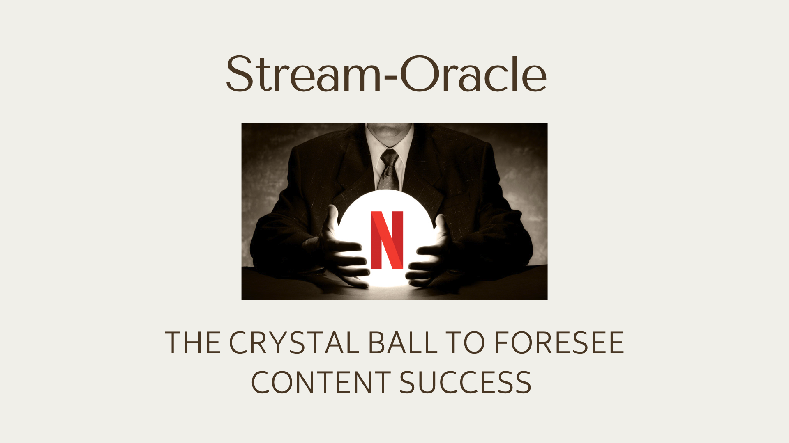
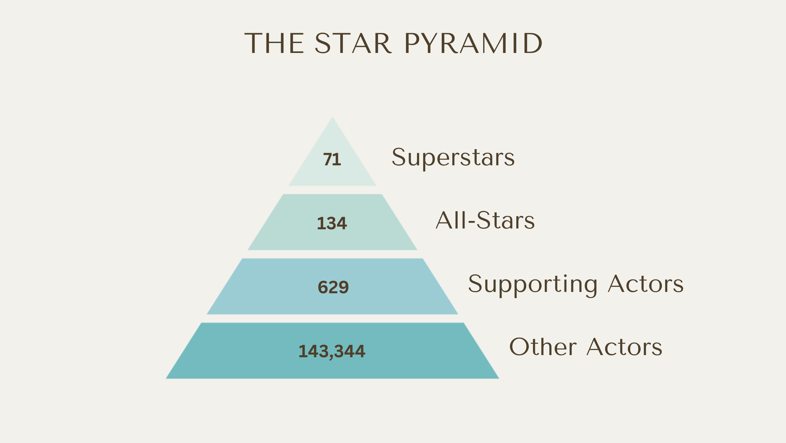
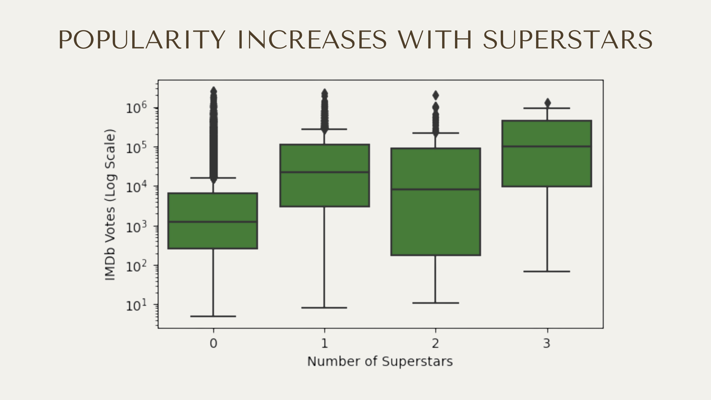
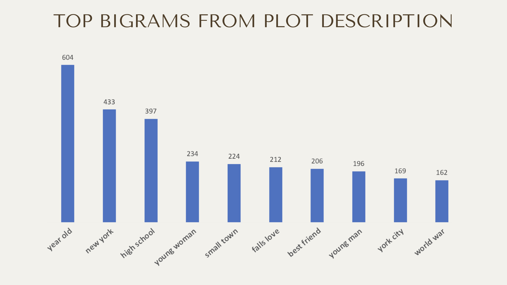
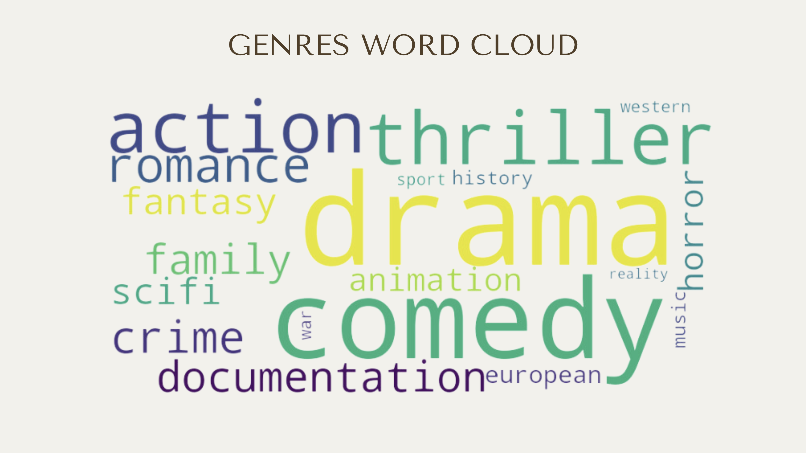
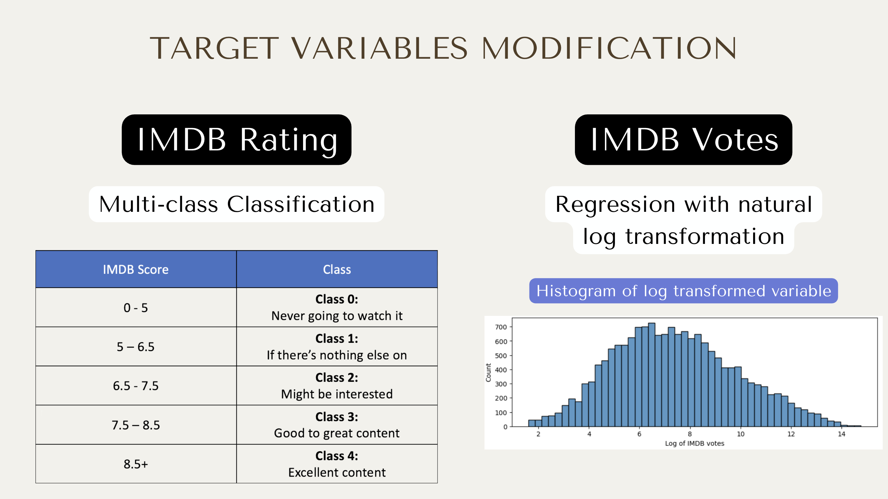
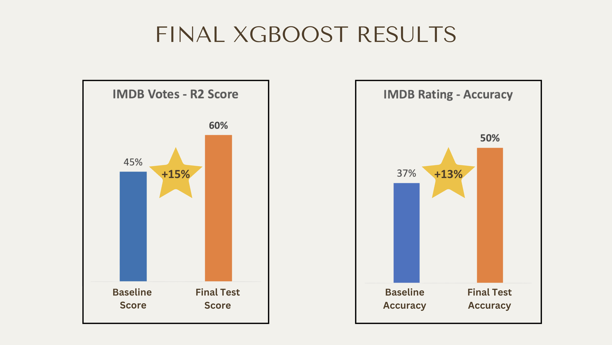
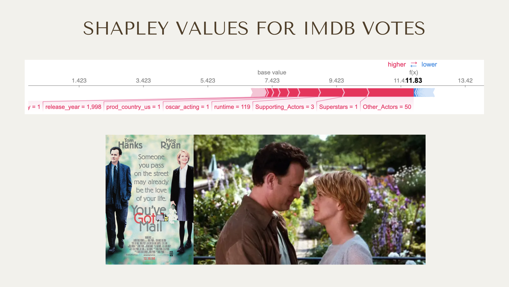

# StreamOracle

## [Demo](https://arjunlokur-capstone-streamlit-app-u5vk3q.streamlit.app/)

## Overview:

I love watching movies and TV shows, constantly on the lookout for what to watch next. And there seems to be no shortage on content across the streaming platforms. This is because the top 5 streaming companies spend over $140 billion annually onncontent. Not all of it works out though, and the reality for streaming companies is different in 2023 - with a lot more competition in the space, subscriber loss and stock prices down from their pandemic highs. That’s why they have a smaller margin for error today.

The goal of this project is to help streamers predict the success of a potential piece of content, using data such as the cast, the plot description, the title, genre etc. This can help them decide whether or not to product/acquire the content in the first place. The ‘success’ being measured here is twofold - the IMDB rating (a measure of quality) and the number of IMDB votes (a measure of popularity).

This is a multi-facted data science project, involving feature engineering, Natural Language Processing (NLP) and machine learning.

## Background on the subject matter:
Given the right data, it would be entirely possible to predict the success of a movie or TV show. Studios are already doing this - have a look at this Verge article about [LA based start-up Cinelytic](https://www.theverge.com/2019/5/28/18637135/hollywood-ai-film-decision-script-analysis-data-machine-learning) that is advising Hollywood on which movies to make.

## Background of the data:

The primary dataset was put together by Kaggle contributor Shivam Bansal. He scraped the website Flixable – (a content search engine of sorts) – to put together title and credits information for all the content on Netflix, HBOMax, Prime Video and Disney Plus. All links to the datasets are at the bottom of this file. The below image is an example of some of the key features for the movie 'The Departed'

The cast in this instance had every single actor/actress in the movie, right from the superstars to the 150th person who was there for 2 seconds.

## Feature Engineering:

Extracting actor Value from Credits table: 
a)	I wanted to identify ‘superstars’ because logically, the popularity of a title increases with the presence of a superstar. To do this, I saw that the actor names in the credits table, for a given title, were listed in order of importance. I then ranked the cast for each movie based on this order, which leads us to our formula for value:

b)	Formula for Value: 

This captures the actors and actresses who’ve been in a lot of movies (that are available on these streaming platforms) and were the most important actors for that movie. It does a reasonable job of capturing superstars. I created cut-off values to classify the actors into 4 different categories with the following count:

This distribution makes sense, because Superstars should be the rarest. The ‘Other_Actors’ is counting the number of ‘extras’ in a movie or TV show.  It’s a useful measure of the scale of a movie - a big budget production like ‘Gladiator’ will have many more extras than a smaller arthouse film.  

The above chart tells us that in general, adding ‘superstars’ (as captured by my metric) to a movie/show increases its popularity. The median value of number of votes (which is the line dividing all the boxes in the middle) trends upwards with number of superstars, peaking at 3.

## NLP:

There were 2 features - Title & Description on which I applied Count Vectorizer, and in an alternate attempt also tried Word Embeddings. Here is an example of the most frequent 2-word combinations from the Description column.

These tell us a lot about what kinds of plots/storylines are the most popular. 'new york', for example, is a very popular setting for movies. 'small town' speaks to specific type of movies (think Hallmark movies). The most frequent one, 'year old' is there because of the way many plot descriptions talk about their protagonist - for example 'a 50 year old woman embarks on a journey...'

And this word cloud below shows us the most popular genres.

## Target Variable Modification:

Before we get into the modeling results, there's 2 modifications of the target variables I'd like to highlight. For IMDB rating, I turned it into a multi-class classification problem with the below classes. As I realized the exact rating value number doesn't matter. We (as potential consumers of content) think of ratings in approximately these ranges, when evaluating whether to stream something or not.

And for the IMDB votes, the original distribution was extremely right-skewed. Due to which I took the natural log tranformation to make it a more normal distribution, which will help at least the linear models.

## Modeling:

I initiually tried a variety of models on both target variable, from basic linear models to KNN, to neural networks to ensemble learning.

XGBoost was the best performing model, so I applied a grid search for hyperparameter tuning. The fully tuned models yielded the below scores, with their respective improvements over the baseline. The baseline r2 score for the IMDB votes was a basic linear regression model. And the baseline accuracy for IMDB rating was the frequency of the most frequent class.

## Local Interpretations using Shapley Values:

We can look at one specific example to interpret which features are driving the score. The example I've selected is 'You've Got Mail', the romcom classic. 

We see that the (log value) of the IMDB votes is 11.83, up from the base value of 7.423. Some of the factors driving it up are:

1. Other_Actors : 50 'other actors' indicates it's a big production, which could be a proxy for bigger budget for the cast, for marketing etc. - all of which mean it's more likely to be a popular movie.
2. Superstars : The feature engineering picks up Tom Hanks as a superstar, though it doesn't recognize Meg Ryan as one (debatable, I would definitely call her one but perhaps she isn't in enough titles available on streaming).
3. Oscar : Hanks' Oscar win helps predict this will be a popular movie.

## Notebooks:

**1 - Capstone**:
This is the notebook kicking off the project. It has all the data cleaning, EDA and feature engineering.

**2 - Awards Data**:
This is supplementary data on the Oscar and Emmy awards that I thought might be useful, which I decided to add in later.

**3 - IMDB Votes Modeling**:
Our first modelling notebook, where I try different models for the regression problem IMDB votes

**4 - IMDB Score Modeling**:
Our second modelling notebook, where I try different models for the classification problem IMDB Score

**5 - Neural Networks with Word Embeddings**:
An alternate approach to modelling and feature engineering, using word embeddings on the 2 text columns (Description and Titles) and then trying neural networks.

## Recreating the conda environment:
The environment set-up is in the requirements.txt file. You can follow input the commands in terminal below to re-create it:
- Create a new conda environment: `conda create -n new_environment_name python=your_python_version`
- Activate the new environment: `conda activate new_environment_name`
- c. Install the packages from the requirements.txt file: `pip install -r requirements.txt`

## Data:
All the data is available in the folder 'final data'. The links to the original source data is:
- [Netflix](https://www.kaggle.com/datasets/shivamb/netflix-shows)
- [Prime Video](https://www.kaggle.com/datasets/shivamb/amazon-prime-movies-and-tv-shows)
- [Disney Plus](https://www.kaggle.com/datasets/shivamb/disney-movies-and-tv-shows)
- HBO Max dataset has since been taken down for some reason, but the data is available in the folder
- [Oscar Winners and Nominees](https://www.kaggle.com/datasets/unanimad/the-oscar-award)
- [Emmy Winners and Nominees](https://www.kaggle.com/datasets/unanimad/emmy-awards)